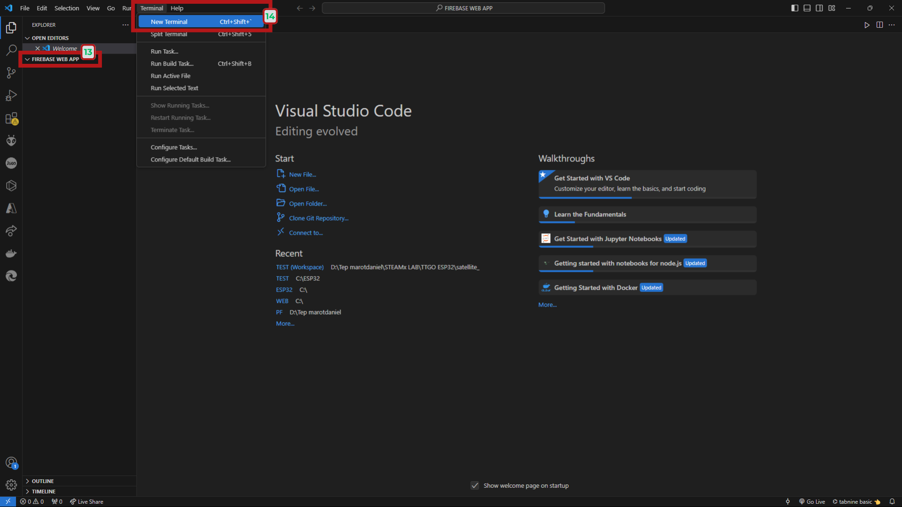

## I. ESP32 WITH FIREBASE-CREATING A WEB APP

This guide will teach you how to create a simple Firebase Web App to control and monitor your ESP32 board. The Web App you’ll create can be accessed worldwide to control and monitor your ESP32 from anywhere in the world. This Web App makes the bridge between the Firebase Realtime Database and the ESP32.

## II. INSTALLING REQUIRED SOFTWARE

**1. INSTALLING Node.js**

* **`1`**: Go to [nodejs.org](https://nodejs.org/en) and download the LTS version.

* **`2`**: Run the executable file and follow the installation process.
* **`3`**: Enable automatically install all the necessary tools.

* **`4`**: When it’s done, click Finish.

* **`5`**:  Terminal window will open to install the Additional Tools for Node.js. When it’s done, click any key to continue. When it’s finished, you can close the Terminal Window.

**2. VISUAL STUDIO CODE**

* **`1`**:**`Download for Windows`** button — click here to start downloading Visual Studio Code for your Windows system.

* **`2`**: The steps to continue the installation — first, select **`I accept the agreement`** 
* **`3`**: Then click **`Next >`**  to proceed with installing Visual Studio Code.

* **`4`**: The step to select additional tasks — check options like **`Create a desktop icon`** and **`Add to PATH`**
* **`5`**: then click **`Next >`** to continue the Visual Studio Code installation.

* **`6`**: Click the **`Install`** button to begin installing Visual Studio Code on your computer.”

**3. CREATING A PROJECT FOLDER**

* **`7`**: Select the **`FIREBASE WEB APP`** folder to open your Firebase project directory.

* **`8`**: Click the Visual Studio Code icon on the taskbar to open VS Code

* **`9`**: Click Open Folder

* **`10`**: Seleced DATA (E)
* **`11`**: Selected ESP32_FIREBASE Web App
* **`12`**: Click Open

* **`13`**: The project folder named **`FIREBASE WEB APP`** opened in VS Code.
* **`14`**: The **`New Terminal`** option to open a terminal for running commands. Shortcut: **`Ctrl + Shift + ~`**

* **`15`**: The terminal is open in the **`FIREBASE WEB APP`** project folder, ready for commands.

